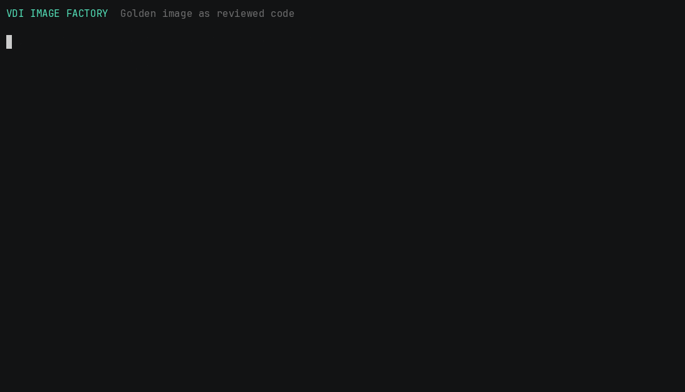
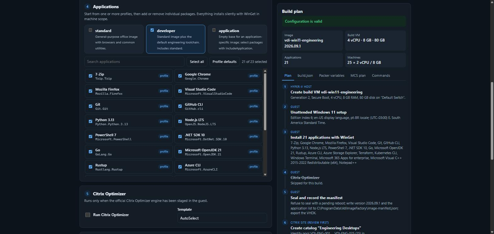

# VDI Image Factory

[](https://github.com/gandara-dev/vdi-image-factory/actions/workflows/ci.yml)
[](LICENSE)

Golden images drift when application installs, OS tuning, sealing, and catalog
updates live in a runbook that only one person knows. VDI Image Factory turns
that sequence into reviewed code: Packer creates a Hyper-V artifact,
PowerShell performs Windows customization, Ansible offers remote orchestration,
and a separate command publishes the resulting snapshot through Citrix MCS.



## Try it: Image Builder

**[Open the Image Builder](https://gandara-dev.github.io/vdi-image-factory/)**:
design a golden image and its MCS machine catalog in the browser, with no
installation.



- Pick the build VM resources, Windows edition, display language, locale, and
  time zone.
- Start from the `standard`, `developer`, or `application` profile and add or
  remove individual packages from the catalog.
- Optionally plan the MCS catalog: naming scheme, machine count, domain, OU,
  pooled or assigned desktops, and per-machine size.
- Download `build.json`, the Packer variables, and a reviewed Citrix SDK plan.

The page runs the same validation as the PowerShell module, and both are tested
against the same fixtures, so a configuration accepted in the browser is
accepted by `New-VdiBuild.ps1`. It is a demo with synthetic example values: it
only generates files and never builds or sends anything. Run it from a clone with
`./scripts/Start-ImageBuilder.ps1 -Open`. See the
[Image Builder guide](docs/image-builder.md).

## Architecture


The guest workflow and MCS publication are deliberately separate. A golden
image does not need Citrix control-plane credentials, and an operator can test
or approve the snapshot before changing a production provisioning scheme.

## Two-minute quick start

Windows PowerShell 5.1 or PowerShell 7 is the only requirement for simulation.
No Hyper-V host, Windows ISO, Citrix site, or SDK is contacted.

```powershell
git clone https://github.com/gandara-dev/vdi-image-factory.git
cd vdi-image-factory
./scripts/Invoke-VdiImagePipeline.ps1 -ApplicationProfile standard -Simulation
```

The result shows the resolved application plan, Optimizer invocation, seal
metadata, and the asynchronous MCS publication that would be requested. Every
hostname, path, UUID, and catalog name used by this mode is synthetic.

To try a complete build configuration, validate the example (or a `build.json`
downloaded from the Image Builder), simulate it, and write the build files:

```powershell
./scripts/New-VdiBuild.ps1 -ConfigPath ./config/build.example.json -OutputDirectory ./build -Simulation
```

## Repository layout

| Path | Purpose |
|---|---|
| `packer/` | Windows 11 generation-2 Hyper-V template and unattended setup |
| `src/VdiImageFactory/` | Testable PowerShell module containing every stage |
| `site/` | Image Builder page; `site/lib/` holds the shared build logic |
| `config/application-catalog.json` | Application library and composable image profiles |
| `config/build.example.json` | Example build configuration for the page and `New-VdiBuild.ps1` |
| `config/windows-*.json` | Locales and Windows time zone IDs accepted by the build |
| `ansible/` | Optional remote Windows customization playbook |
| `scripts/` | Operator entry points for simulation and MCS publication |
| `tests/` | Infrastructure-free Pester and Node tests with shared fixtures |

## Build a Hyper-V image

Requirements:

- Windows 11 Pro or Enterprise with Hyper-V enabled;
- [Packer 1.16.1](https://developer.hashicorp.com/packer/install);
- a properly licensed Windows 11 ISO and its SHA-256 checksum;
- enough local disk and memory for the VM.

Generate the variables from a build configuration, supply the temporary WinRM
password through the environment, and build. The generated file contains no
secrets; `*.auto.pkrvars.hcl` and `build/` are ignored by Git.

```powershell
./scripts/New-VdiBuild.ps1 -ConfigPath ./build.json -OutputDirectory ./build
./scripts/Test-PackerTemplate.ps1 -VariableFile ./build/build.auto.pkrvars.hcl
$env:PKR_VAR_winrm_password = '<temporary password, 16+ characters>'
packer build -var-file ./build/build.auto.pkrvars.hcl `
    -var 'iso_url=file:///C:/ISO/Windows11.iso' `
    -var 'iso_checksum=sha256:<ISO checksum>' `
    ./packer
```

Alternatively, copy `packer/variables.pkrvars.example.hcl` to an ignored
`packer/private.auto.pkrvars.hcl` and edit it by hand. `Test-PackerTemplate.ps1`
runs `packer init`, `packer fmt -check`, and `packer validate` with obvious
placeholders for the ISO and password, so it also works on a fresh clone.

Confirm `windows_image_index` against your ISO with DISM before building; the
default index is only an example. `ui_language` must be a language included in
the ISO; `locale` sets the input, system, and user locale, and `time_zone` takes
a Windows time zone ID such as `E. South America Standard Time`. The WinRM password validator accepts a
restricted XML-safe character set because it is rendered into unattended XML.

The template pins the official Hyper-V plugin to `1.1.5`, creates a generation-2
VM with Secure Boot, resolves packages from `config/application-catalog.json`, writes
`C:\ProgramData\VdiImageFactory\image-manifest.json`, shuts down, and compacts
the disk. Add organization-specific VDA installation and Windows Update stages
before using the output in production.

The unattended file contains a temporary local `packer` administrator. Rotate
or remove that account in your production hardening stage. Use only ephemeral
build credentials.

## Customizable application profiles

The catalog separates the package library from image profiles. Applications are
defined once with an exact WinGet ID:

```json
{
  "name": "7-Zip",
  "id": "7zip.7zip",
  "version": "",
  "scope": "machine"
}
```

Profiles then select package IDs and can inherit another profile:

| Profile | Default content | Intended use |
|---|---|---|
| `standard` | Chrome, Firefox, Microsoft 365, 7-Zip, and Visual C++ Runtime | General office desktop |
| `developer` | Everything in `standard` plus VS Code, Git, GitHub CLI, Python, Node.js, PowerShell, .NET, Go, Java, Rust, Azure tools, Terraform, kubectl, Windows Terminal, and Postman | Engineering workstation |
| `application` | Empty | Purpose-built image with an explicit application selection |

Preview any profile without changing the machine:

```powershell
./scripts/Invoke-VdiImagePipeline.ps1 `
  -ApplicationProfile developer `
  -SkipPublish `
  -Simulation
```

Add or remove tools for a single build without editing the catalog:

```powershell
./scripts/Invoke-VdiImagePipeline.ps1 `
  -ApplicationProfile developer `
  -IncludeApplication 'Notepad++.Notepad++' `
  -ExcludeApplication 'Microsoft.OpenJDK.21','Rustlang.Rustup' `
  -SkipPublish `
  -Simulation
```

Build an application-specific plan by choosing exact entries from the library:

```powershell
./scripts/Invoke-VdiImagePipeline.ps1 `
  -ApplicationProfile application `
  -IncludeApplication 'Google.Chrome','Postman.Postman' `
  -SkipPublish `
  -Simulation
```

Use `-IncludeApplication '*'` with the `application` profile to select every
catalog entry. Multiple profiles can be combined, duplicates are removed, and
`-ExcludeApplication` is applied last. To make a permanent change, add or remove
IDs in a profile's `applications` array. To introduce new software, add its
metadata to the top-level `applications` array and reference that ID from a
profile. Invalid IDs, duplicate IDs, missing parents, and inheritance cycles
stop the build before WinGet runs.

The ID is passed to WinGet with exact matching, silent mode, agreement flags,
and explicit scope. `machine` is the default so software is available beyond
the temporary Packer account. Leave `version` empty for the source's current
version, or pin a version available in your approved repository. Production
environments should use a controlled WinGet source or internal package repository.

Microsoft 365 installation does not grant a license. The organization must
provide an eligible subscription, activation method, update channel, and Office
configuration appropriate to the VDI licensing model. Replace the generic
WinGet package with an approved Office Deployment Tool configuration when
shared-computer activation or channel control is required.

Docker Desktop and Notepad++ are available in the library but are not selected
by a default profile. Docker Desktop requires a separate licensing review, WSL 2
or Hyper-V support, and nested virtualization. Include it only in a compatible
developer image.

Every sealed image manifest records the selected profile names and resolved
application IDs, making the package composition auditable. See the
[application catalog guide](docs/application-catalog.md) for schema and Packer
and Ansible examples.

## Citrix Optimizer

Citrix Optimizer is not redistributed by this project. Download it through the
[official Citrix support article](https://support.citrix.com/external/article/CTX224676/citrix-optimizer-tool.html),
review the template for your OS and workload, and stage it in the guest. Then
enable it in your private Packer variables:

```hcl
run_optimizer        = true
optimizer_engine_path = "C:\\CitrixOptimizer\\CtxOptimizerEngine.ps1"
optimizer_template    = "AutoSelect"
```

The wrapper invokes `CtxOptimizerEngine.ps1` with `-Source` and `-Mode`. Start
with `Analyze` in a representative test image; optimization changes OS behavior
and should be regression-tested with your VDA version and applications.

## Remote customization with Ansible

Install the declared Windows collection, copy the synthetic inventory, and keep
the real inventory plus credentials outside source control:

```bash
ansible-galaxy collection install -r ansible/requirements.yml
cp ansible/inventory.example.ini ansible/inventory.ini
ansible-playbook -i ansible/inventory.ini ansible/playbook.yml \
  -e vdi_image_version=2026.09.1
```

Use Ansible Vault or an external secret manager for WinRM credentials. The
example disables certificate validation only because it uses a placeholder
lab endpoint; production WinRM should use a trusted HTTPS certificate.

## Publish a snapshot to MCS

Run publication from a trusted management host with the Citrix Machine Creation
SDK installed and an authenticated administrator session:

```powershell
./scripts/Publish-McsImage.ps1 `
  -ProvisioningSchemeName 'Windows 11 - Production' `
  -MasterImageVM 'XDHyp:\HostingUnits\Primary\gold-2026-09.snapshot' `
  -AdminAddress 'controller.example.test' `
  -WhatIf
```

Remove `-WhatIf` only after reviewing the target. The command uses
`Publish-ProvMasterVMImage -RunAsynchronously`; it starts a task rather than
waiting for rollout completion. Monitor the returned task in Citrix Studio or
with the SDK, validate canary machines, and use your existing rollback process
before broad deployment.

## Seal behavior

`Complete-VdiImage` refuses a live seal when common Windows pending-reboot
markers exist. It records build time, version, computer name, and reboot state.
It does not run Sysprep or remove environment-specific agents: those decisions
depend on the target provisioning method and must be explicit in your image
standard.

## Tests and validation

```powershell
Install-Module Pester -RequiredVersion 5.7.1 -Scope CurrentUser
Invoke-Pester ./tests/VdiImageFactory.Tests.ps1 -Output Detailed
node --test tests/web/*.test.mjs
```

The PowerShell and Node suites read the same fixtures in `tests/fixtures`:
validation cases, catalog resolution cases, and golden Packer and MCS output. CI
runs Pester on Windows and Linux (and Windows PowerShell 5.1), the Node suite,
PSScriptAnalyzer, `packer fmt`, `packer validate` of the template and of a
generated variable file, Ansible syntax checking, and `ansible-lint`. It never builds
a Windows VM or contacts a Citrix site, so pull requests need no infrastructure
credentials.

## Safety

- Use `-Simulation` to inspect the whole plan without side effects.
- Use `-WhatIf` on the publication command before changing an MCS scheme.
- Never commit ISO files, credentials, private inventories, or Citrix exports.
- Snapshot and test the image in a non-production catalog first.
- Treat image updates as changes with monitoring and a documented rollback.

## Documentation

- [Architecture](docs/architecture.md)
- [Image Builder](docs/image-builder.md)
- [Application catalog](docs/application-catalog.md)
- [Operations guide](docs/operations-guide.md)
- [Testing guide](docs/testing.md)
- [Release verification](docs/release-verification.md)
- [Security policy](SECURITY.md)
- [Contributing](CONTRIBUTING.md)

## License

[MIT](LICENSE)
