# Architecture

VDI Image Factory separates guest-image construction from Citrix control-plane
publication. This prevents build credentials from becoming catalog credentials
and creates an approval boundary between a sealed artifact and an MCS update.

## Pipeline stages

1. Packer creates a generation-2 Hyper-V VM from a licensed Windows ISO.
2. The guest workflow installs enabled applications from `config/apps.json`.
3. Citrix Optimizer runs only when explicitly enabled with a user-supplied tool.
4. Pending-reboot checks protect the seal boundary.
5. The workflow writes an image manifest and shuts down the guest.
6. An operator creates and validates a hypervisor snapshot.
7. A separate management-host command requests asynchronous MCS publication.

Simulation executes the orchestration contract without Hyper-V, an ISO, Citrix
SDK commands, or external infrastructure.

## Components

- `packer/` owns VM creation, unattended setup, WinRM bootstrap, and VHDX output.
- `src/VdiImageFactory/` contains testable PowerShell stages.
- `scripts/Invoke-VdiImagePipeline.ps1` is the local pipeline entry point.
- `scripts/Publish-McsImage.ps1` is the deliberately separate MCS entry point.
- `ansible/` provides optional remote orchestration of the guest workflow.

## Trust boundaries

The Windows ISO, package source, Optimizer files, and application manifest are
build inputs and must be reviewed. Temporary WinRM credentials exist only for
the ephemeral build. Citrix administration occurs later on a trusted management
host with an authenticated SDK session. Neither credentials nor customer data
belong in the repository or image manifest.

## Failure and rollback boundaries

The workflow fails on application installation, Optimizer, pending reboot, or
manifest errors. It does not automatically publish or roll back an MCS image.
After publication, operators monitor the asynchronous task, test canary machines,
and use their existing provisioning-scheme rollback procedure.

## Current limitations

Version `0.1.0` does not run Windows Update, install a VDA, run Sysprep, create
hypervisor snapshots, monitor asynchronous MCS tasks, or implement automatic
rollback. Those environment-specific controls must remain explicit.
